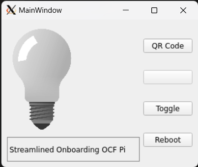
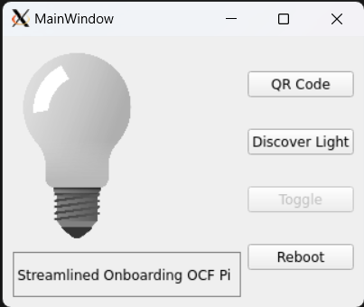
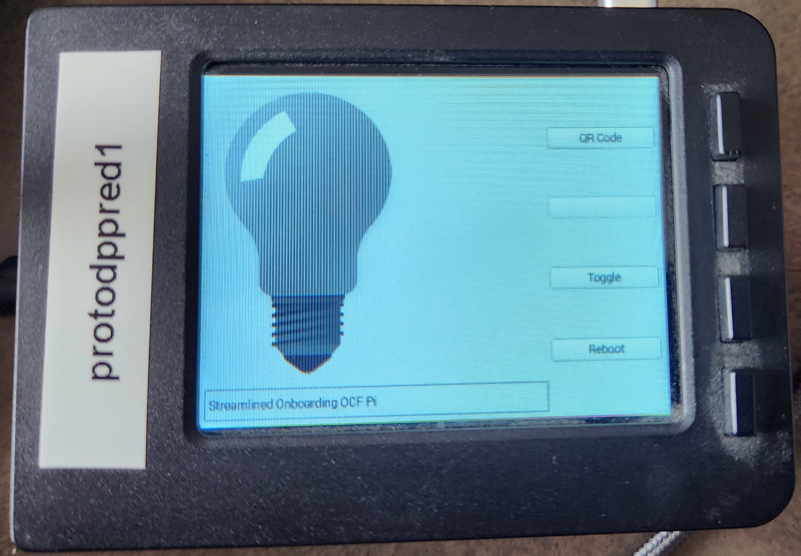
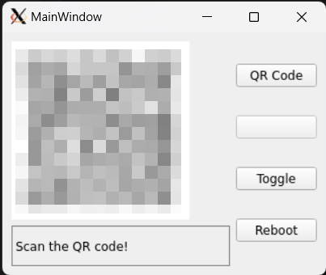
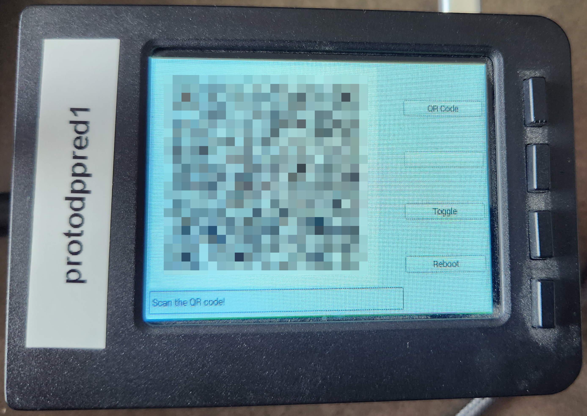
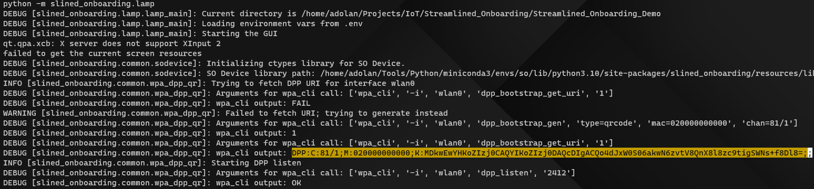
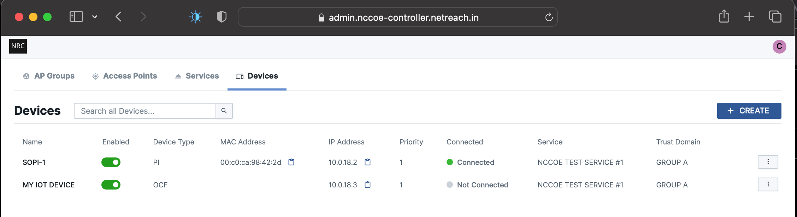
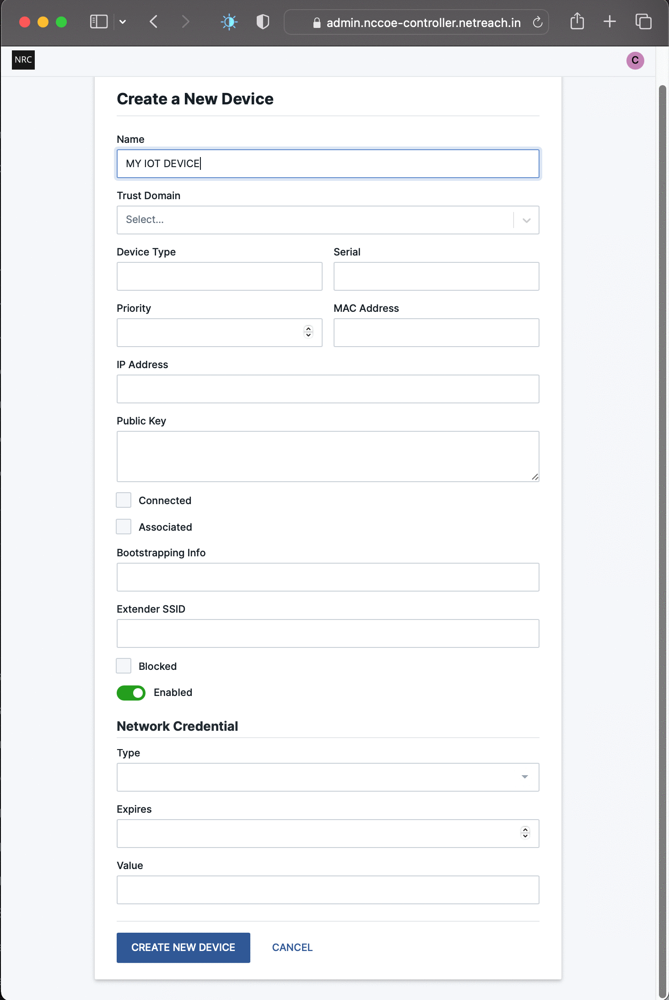

# Streamlined Onboarding Demo Deployment for Raspberry Pi

*Andy Dolan ([a.dolan@cablelabs.com](mailto:a.dolan@cablelabs.com))*

This document provides a brief summary of how to deploy the streamlined
onboarding demo on a set of Raspberry Pis. This guide assumes the use of the
NetReach AP components (`hostapd`, `dnsmasq` with lease notification script).
Refer to the [NetReach AP documentation](./Ref-AP-Setup-for-NCCoE/nccoe-ap-setup.md)
for details on installing those components.

This configuration is consistent with the lab environment used for the 2023
NCCoE IoT Onboarding project. This guide provides high-level steps; for more
specifics, refer to the other [documentation](./) in the Streamlined Onboarding
Demo repository.

## Hardware Setup Summary

This demo's hardware configuration consists of 4 Raspberry Pis, each with a
compatible Wi-Fi adapter (e.g., Atheros AR9271), running at least
Debian/Raspberry Pi OS 10:

* Access Point (AP): Can be headless (no GUI/Desktop Environment)
  * See [NetReach documentation](./Ref-AP-Setup-for-NCCoE/nccoe-ap-setup.md) for
    instructions on initial configuration.
* OBT Pi: Headless
  * Run on separate device due to VLAN requirement [caveat](../README.md#obt-and-vlans)
  * Assumed to be onboarded to the network ahead of demo execution.
* Client Pis (2):
  * Raspberry Pi OS with Desktop
  * [Adafruit PiTFT](https://www.adafruit.com/product/2423) installed &
    configured (see product support for details).

It is recommended that the onboard Wi-Fi adapter on each Pi be disabled. This
can be achieved by adding `dtoverlay=disable-wifi` to the Pi's `config.txt`
file (see [documentation](https://www.raspberrypi.com/documentation/computers/config_txt.html#what-is-config-txt)).

With the onboard adapter disabled, the Pi should have only a single Wi-Fi
interface, which this guide will assume is referred to as `wlan0`.

## Component Installation

See the [build documentation](./Build.md) for a summary of installation paths of
each component. This section assumes that all binaries, configurations, and
templates have been downloaded from the release page or the CableLabs
Artifactory (via the commands below):

```sh
curl -L -O "https://artifactory.cablelabs.com/artifactory/micronets-nccoe/packages/dpp-diplomat/dpp_diplomat"
curl -L -O "https://artifactory.cablelabs.com/artifactory/micronets-nccoe/packages/dpp-diplomat/onboarding_tool"
curl -L -O "https://artifactory.cablelabs.com/artifactory/micronets-nccoe/packages/dpp-diplomat/diplomat.service"
```

### Access Point

For installation of Wi-Fi components of the AP Pi, refer to the [NetReach
documentation](./Ref-AP-Setup-for-NCCoE/nccoe-ap-setup.md).

The following steps should be taken to install the streamlined onboarding
components on the AP Pi:

1. Install the following binaries to `/opt/streamlined_onboarding/bin`:
   * `dpp_diplomat`
2. Create the credentials directory for the Diplomat in
   `/opt/streamlined_onboarding/lib`:
   * `dpp_diplomat_creds`
3. Install the `systemd` service for the DPP Diplomat:
   * Install `diplomat.service` to `/etc/systemd/system`
   * Run `systemctl daemon-reload` (as root/with `sudo`)
   * Optionally enable the diplomat service to run on boot with `systemctl
     enable diplomat.service` (as root/with `sudo`).

The following snippet performs all of the steps described above (assumes use of
`sudo` and that all necessary files are in current working directory):

```sh
#!/bin/bash
export INSTALL_DEST=/opt/streamlined_onboarding
sudo mkdir -p $INSTALL_DEST/bin $INSTALL_DEST/lib/dpp_diplomat_creds
sudo install -t $INSTALL_DEST/bin dpp_diplomat
sudo install -m 644 diplomat.service /etc/systemd/system
sudo systemctl daemon-reload
sudo systemctl enable diplomat.service
unset -v INSTALL_DEST
```

### OBT Pi

1. Install the modified Wi-Fi components in the same fashion described for the
   client Pis [below](#client-pis).
2. Install the following binaries to `/opt/streamlined_onboarding/bin`:
   * `onboarding_tool`
3. Create the credentials directory for the OBT in
   `/opt/streamlined_onboarding/lib`:
   * `onboarding_tool_creds`

The following snippet performs the steps described above:

```sh
#!/bin/bash
export INSTALL_DEST=/opt/streamlined_onboarding
sudo mkdir -p $INSTALL_DEST/bin $INSTALL_DEST/lib/onboarding_tool_creds
sudo install -t $INSTALL_DEST/bin onboarding_tool
unset -v INSTALL_DEST
```

### Client Pis

This guide assumes the use of the modified `wpa_supplicant` included in this
repository (and release). However, the NetReach variant may also be used.

The following steps should be taken to install the streamlined onboarding
components on the client Pis:

1. Install the modified Wi-Fi components to `/opt/streamlined_onboarding` and
   create symlink in `/usr/sbin`:
   * Install `wpa_supplicant` to `/opt/streamlined_onboarding/bin`
   * Install `wpa_cli` to `/opt/streamlined_onboarding/bin`
   * Stop `dhcpcd` service with `sudo systemctl stop dhcpcd.service`
   * Back up system-installed `/usr/sbin/wpa_supplicant` (to, e.g.,
     `/usr/sbin/wpa_supplicant.orig`)
   * Back up system-installed `/usr/sbin/wpa_cli` (to, e.g.,
     `/usr/sbin/wpa_cli.orig`)
   * Create symlink to modified supplicant & components in `/usr/sbin` using the
     following commands:
     ```sh
     sudo ln -s /opt/streamlined_onboarding/bin/wpa_supplicant /usr/sbin
     sudo ln -s /opt/streamlined_onboarding/bin/wpa_cli /usr/sbin
     ```
   * Restart `dhcpcd` with `sudo systemctl restart dhcpcd.service`
2. Install modified Wi-Fi libraries leveraged by client applications:
   * Install `libwpa_client.so` to `/usr/local/lib`
   * Install `wpa_ctrl.h` to `/usr/local/include`
3. Install Python client module
   * Install system dependency `python3-pyqt5` via `apt`
   * Install client module from wheel package with, e.g. `pip install
     ./so_demo-0.0.2-py3-none-any.whl`
   * Install client application environment file (e.g., `dotenv_template`) to
     `/etc/opt/streamlined_onboarding/prod.env`
   * Optionally install the autostart `*.desktop` file(s) to
     `/home/pi/.config/autostart`.
     * To enable the autostart file, remove line 2 (`Hidden=true`) for only ONE
       `.desktop` file.

The following snippet performs all of the steps described above, again assuming
that all necessary files are located in the current working directory:

```sh
#!/bin/bash
export INSTALL_DEST=/opt/streamlined_onboarding CONFIG_DEST=/etc/opt/streamlined_onboarding
sudo mkdir -p $INSTALL_DEST/bin $CONFIG_DEST
mkdir -p $HOME/.config/autostart

 # Wi-Fi components
sudo install -t $INSTALL_DEST wpa_{supplicant,cli}
sudo systemctl stop dhcpcd.service
sudo mv /usr/sbin/wpa_supplicant{,.orig}
sudo mv /usr/sbin/wpa_cli{,.orig}
sudo ln -s $INSTALL_DEST/wpa_supplicant /usr/sbin
sudo ln -s $INSTALL_DEST/wpa_cli /usr/sbin
sudo systemctl restart dhcpcd.service

 # Wi-Fi libraries
sudo install -m 644 libso.so /usr/local/lib
sudo install -m 644 wpa_ctrl.h /usr/local/include

 # Python client module
sudo apt update && sudo apt install -y python3-pyqt5
pip install ./so_demo-0.0.2-py3-none-any.whl
sudo install -m 644 dotenv_template $CONFIG_DEST/prod.env
install -m 644 -t $HOME/.config/autostart {lightswitch,lamp}.desktop

 # Cleanup
unset -v INSTALL_DEST CONFIG_DEST
```

## Starting Components

Refer to the [running documentation](https://github.com/cablelabs/Streamlined_Onboarding_Demo/blob/master/docs/Running.md)
for more detail on manually starting each component of the demo.

### Access Point

Use the following steps to start the components on the AP:

1. Start the Wi-Fi & network components
   * Refer to the [NetReach documentation](./Ref-AP-Setup-for-NCCoE/nccoe-ap-setup.md)
     for details on how to start (or restart) the Wi-Fi and other network
     components.
2. Start (or restart) the Diplomat:
   * Restart the DPP Diplomat service with `sudo systemctl restart
     diplomat.service`

### OBT Pi

Use the following steps to start the components on the OBT Pi:

1. Start the onboarding tool
   * Start the OBT by executing the `onboarding_tool` binary from within the
     `/opt/streamlined_onboarding/lib` directory.
   * The main OBT menu should be displayed and prompt for you to select an
     option.

### Client Devices

Use the following steps to start the client devices. Note that, if the Python
clients are configured to start on device boot (using the `.desktop` files),
ensure that they are stopped/killed before restarting.

1. Update `/etc/wpa_supplicant/wpa_supplicant.conf` to contain the following:
   ```
   ctrl_interface=DIR=/var/run/wpa_supplicant GROUP=netdev
   update_config=0
   country=US
   pmf=2
   dpp_config_processing=2
   ```
2. Restart `dhcpcd` using `sudo systemctl restart dhcpcd.service`
3. Optionally create the OCF credentials directories to persist onboarding &
   provisioning of the client devices across runs:
   * `sudo mkdir -p /var/opt/streamlined_onboarding/{lamp,lightswitch}_creds`
4. Verify that the configuration variables in `/etc/opt/streamlined_onboarding/prod.env`
   are correct.
5. Use the following commands to start the lamp & light switch client
   applications (on separate Pis):
   * Note that, if running over SSH or with X forwarding, you may need to set
     the `DISPLAY` variable ahead of the following invocations (e.g.,
     `DISPLAY=:0` to launch on the local Adafruit display.
   * To start the lamp device:
     ```sh
     set -a
     source /etc/opt/streamlined_onboarding/prod.env
     python -m slined_onboarding.lamp
     ```
   * To start the light switch device:
     ```sh
     set -a
     source /etc/opt/streamlined_onboarding/prod.env
     python -m slined_onboarding.lightswitch
     ```

## Initial Provisioning of Diplomat

A final one-time step that is required is using the OBT to onboard & provision
the Diplomat. See the [running documentation](https://github.com/cablelabs/Streamlined_Onboarding_Demo/blob/master/docs/Running.md#initial-provisioning-of-diplomat)
for more details. It is assumed that the OBT Pi has been associated to the
network before this provisioning step takes place. The following steps can be
executed using the OBT to perform initial provisioning of the DPP Diplomat:

1. Discover unowned devices (option `1`)
2. Onboard with Just Works (option `8`)
   * Select the `DPP Diplomat` for the device to onboard
3. Provision ACE2 (option `13`)
   * Device selection: `DPP Diplomat`
   * Subject: `(OBT)`
   * Number of resources in this ACE: `1`
   * Have resource href: `1 (Yes)`
   * Enter resource href: `/diplomat` (include forward slash)
   * Permissions: `1` (Yes) for each of `CREATE`, `RETRIEVE`, `UPDATE`, `DELETE`,
     `NOTIFY`
4. Observe Diplomat (option `41`)

The correct output at the end of these steps should look similar to the
following:

```
Resource /diplomat hosted at endpoints:
coaps://[<ipv6address>]:<port>
Sent OBSERVE request
Observe Diplomat:

```

Note that only one observe operation (option `41`) needs to be executed from the
OBT. Once subscribed via the initial observe, the Diplomat will send subsequent
streamlined onboarding information notifications to the OBT as it receives them.

## Executing The Demo

This section assumes the use of the NetReach cloud-based controller for starting
network onboarding. Application-level onboarding follows network-level
onboarding.

It is recommended that all of the following steps be performed sequentially on
each device individually - that is, entirely onboard one client device, then the
other.

### Display DPP URI (QR Code) on Client Device

The interfaces of the lamp and lightswitch devices are pictured below:





On the physical Pis, the 4 QT buttons displayed in the software correspond to
the 4 physical buttons of the PiTFT hat (pictured below in a case with button
covers):



The first (top) button can be used to display the QR code on the interface, as
depicted below:





This code can be scanned with a camera to retrieve the DPP URI. Alternatively,
if invoking the client applications from the command line, the URI is also
printed to the console, as seen below:



Either way, this URI is then provided to the NetReach controller to start
network onboarding, described in the next section.

### Initiate Network Onboarding

This section assumes that all initial provisioning of the access point through
the NetReach controller is complete at this point. See the [NetReach
documentation](./Ref-AP-Setup-for-NCCoE/nccoe-ap-setup.md) for details on
initial provisioning of the AP's network.

To begin network onboarding & subsequent application-level onboarding through
streamlined onboarding, use the following steps:

1. Select "create" at the top of the "Devices" tab of the NetReach controller
   (shown below).




2. Enter the device information into the create device form:
   * Device name
   * Trust domain
   * Device type
   * **Bootstrapping info: The DPP URI fetched in the prvious section**
3. Add a network credential for the device:
   * Type: WPA2\_PASSPHRASE

   The gif below summarizes each of the fields to populate in the device
   creation form:

   

4. Submit the form by clicking "create new device".

Once the device has been created, the device details page for the device should
be displayed, an example of which appears below:


#### Confirming Onboarding

Once the device creation form has been submitted, network onboarding should take
place. The following is expected to take place:

* DPP executes between the AP and the client device, as part of which
  streamlined onboarding information is shared.
* The DPP configurator (IE, `hostapd`) on the access point provides the
  `dpp_diplomat` this streamlined onboarding information
* The `dpp_diplomat` waits for `dnsmasq` to add data to the leases notification
  named pipe
  * This pipe is identified by the `DHCP_NAMED_PIPE` variable set when starting
    the diplomat (or defined in its service file).
* Once the client is assigned an IP and the DHCP pipe is written to, the
  diplomat sends an OCF OBSERVE response to the OBT, which is still polling for
  streamlined onboarding information.
* Upon receiving this information the `onboarding_tool` issues a request to
  automatically onboard the client.

If each component executes correctly, the following should be observed:

* The client device has associated to the AP's network and has been assigned an
  IP address that corresponds to that displayed in the NetReach controller's
  device details page.
* The `onboarding_tool` should have displayed messages indicating that:
  * It had received an OBSERVE response from the diplomat
  * It had attempted to onboard a device identified by a UUID
  * The onboarding had completed successfully
* The client device should now be "owned" by the `onboarding_tool`
  * This can be verified in the `onboarding_tool` with option `4` (discover
    owned devices), which should output endpoints for 2 devices (the diplomat
    and the newly onboarded client device).

### (Optional) Device Interaction

Once both OCF client devices have been onboarded, the OBT can be used to
initially provision them so that the light switch can act on the lamp using OCF
operations. The following steps can be used to achieve this:

1. In the `onboarding_tool`, rediscover unowned devices (option `4`)
2. Provision pairwise credential (option `12`)
   * Device 1: `SO Light Switch`
   * Device 2: `SO Lamp`
3. Provision ACE2 (option `13`)
   * Object: `SO Lamp`
   * Subject: `SO Light Switch`
   * Number of resources in this ACE: `1`
   * Have resource href: `1 (Yes)`
   * Enter resource href: `/a/light` (include forward slashes)
   * Permissions: `1` (Yes) for each of `CREATE`, `RETRIEVE`, `UPDATE`, `DELETE`,
     `NOTIFY`
4. On light switch device, select the "discovery light" button
   * If the lamp is discovered, the "toggle" button on the light switch device
     should become active.
5. On the light switch device, select the "toggle" button to toggle the lamp.
   * If the device was provisioned properly, the light images on both devices
     should actuate.

## Troubleshooting

* It is recommended that the steps above be executed **in their entirety** for
  **one client device at a time.**

### Logs

Some useful logs/areas to observe during the execution of the demo include the
following:

* Output of the diplomat:
  * Console if invoked manually
  * `sudo journalctl -u diplomat.service -f` if using `systemd` service
* The main `micronets-gw` log: `/opt/micronets-gw/micronets-gw.log`

### Diplomat and DHCP Notification Named Pipe

* The current implementation of the DPP Diplomat blocks when reading from the
  DHCP notification named pipe, and does not perform any validation of the
  information that is provided by the DHCP service (`dnsmasq`) to the named
  pipe. This can cause some potential complications:
  * If the notification named pipe fails to be created or cannot be written to,
    then the diplomat will never receive information and indefinitely block.
  * If the notification named pipe was created as a plaintext file (e.g., if
    `dnsmasq` wrote to it before the Diplomat created it), then the Diplomat may
    always have data to read from the pipe and may provide a notification to the
    OBT too early (before the client device has been assigned an IP address).
  * If the demo has been executed several times in a row without the Diplomat,
    or if other non-OCF devices have been assigned an IP address, the named pipe
    may have "extra" data in it that the Diplomat will read and thus notify the
    OBT too early.

### Resetting Demo Components

1. Delete devices from the NetReach controller using the admin portal.
2. Stop all OCF-related binaries on all devices:
   * `onboarding_tool` (exit gracefully with option `99`)
   * `dpp_diplomat` (stop service with `sudo systemctl stop diplomat.service`)
   * Python client applications: kill main Python process (e.g., `python -m
     slined_onboarding.(lamp|lightswitch)`
3. Remove contents of all credentials directories to reset provisioning steps:
   ```sh
   #!/bin/bash
   sudo rm /opt/streamlined_onboarding/lib/{onboarding_tool,dpp_diplomat}_creds/*
   sudo rm /var/opt/streamlined_onboarding/{lightswitch,lamp}_creds/*
   ```
   * Note that the client devices are configured to not persist their
     credentials by default (see `prod.env`)
   * Note that the OBT & Diplomat credentials only need to be removed if the
     inital provisioning of the Diplomat needs to be repeated
3. Verify that the contents of `/etc/wpa_supplicant/wpa_supplicant.conf` do not
   have any unnecessary `network` blocks.
4. On the AP Pi, restart the `micronets-hostapd` and `micronets-gw` services.
5. On client & OBT Pis, restart `dhcpcd` via `sudo systemctl restart
   dhcpcd.service`
6. Remove the DHCP notification named pipe from the AP using `sudo rm
   /var/run/diplomat/leases`
7. Restart the OCF components stopped in step 1 (see instructions
   [above](#starting-components)).
