# Installation and setup of the Custom Connectivity Reference AP components

The Custom Connectivity (formerly "NetReach") reference access point (AP) runs on a Raspberry Pi 3 or 4 running the Raspbian 10 OS distribution.
Once configured, the reference AP can provide WiFi-based internet access and virtual local area networking via a backhaul network. 
Additionally, this version of the reference AP also includes features to enable Layer-3 streamlined IoT onboarding of OCF devices.

The backhaul network should be connected to the Pi's built-in ethernet port and an external WiFi adapter should be connected via USB to provide WiFi access. 
Multiple reference APs can be connected via common backhaul can be provisioned as a Custom Connectivity *AP Group* and form a mesh to provide expanded coverage while maintaining virtual LAN capabilities.

This guide is divided into three sections:

* Configuration of the reference AP's system settings 
* Installing the reference AP software and dependencies
* Provisioning of the AP and test Service using the Custom Connectivity Controller admin interface
* Configuring and starting the reference AP components

Once complete, the AP should be ready to onboard devices and configure additional Services/Trust Domains using the Custom Connectivity Controller admin interface and other.
These steps can be repeated for multiple APs to create a mesh network.

## Configuring system settings

The following settings are not strictly necessary for the gateway and hostap functionality to work but following them will ensure that you have a more optimal system to work with. 
The following settings disables certain spurious services that are activated by default on all new interfaces

### Disabling the built-in WiFi adapter

Since the internal WiFi adapter doesn't support the features needed to support Custom Connectivity, it's best to disable it - as an internal WiFi adapter can show up as "wlan0" or "wlan1" unpredictably - causing unpredictable behavior.
To disable the built-in WiFi adapter, add this entry to the end of file `/boot/config.txt`

```
dtoverlay=disable-wifi
```

and reboot the Raspberry Pi.
This will cause the external Wifi adapter (e.g. Qualcomm Atheros AR9271) to show up as interface `wlan0`.

### Reducing dhcpcd chatter

Edit the `/etc/dhcpcd.conf` file and add the following at the end:

```
allowinterfaces eth0
```
This will ensure that dhcpcd does not get invoked on the other interfaces that we will be creating later

### Reducing avahi chatter

Edit the /etc/avahi/avahi-daemon.conf file and change the following lines:

```
use-ipv4=no
use-ipv6=no
allow-interfaces=eth0
```

This ensures that avahi and mDNS traffic is suppressed from the router (we will still allow this traffic from clients, just not the router itself)

## Installing the Custom Connectivity and streamlined onboarding components

### Removal of existing components

If you have prior versions of the micronets gateway agent and/or micronets-hostap packages installed, please stop and uninstall them prior to installing this release using `dpkg remove`.

- Take a backup of your `/opt/micronets-hostapd/lib/hostap.conf` and `/opt/micronets-gw/config.py` files if you have made any changes to them
- Remove the `/opt/micronets-gw` and `/opt/micronets-hostapd` directories
- Remove the `/etc/network/interfaces.d/micronets` file if it's present (this file is deprecated)

* Note: Backed up files should not necessarily be restored as-is, since the new release may contain new versions of these files. They should be used as a reference for future changes.

### Installing dependent packages

Currently the Custom Connectivity gateway agent requires Raspbian OS version 10.

On Raspbian 10, most dependencies are provided by the distribution.
To install the additional packages required for the reference implementation, perform the following steps:

```
sudo apt-get update
sudo apt-get install dnsmasq openvswitch-switch python3 virtualenvwrapper
```

### Installing the gateway agent with DPP/EasyConnect support

The Micronets Gateway Service contains the Custom Connectivity agent as an "adapter" and is architecture-neutral. To install it run the following bash commands:

```
curl -L -O "https://artifactory.cablelabs.com/artifactory/micronets-nccoe/packages/micronets-gw-1.2.2-nccoe-so-U18.04+.deb"
sudo dpkg -i "micronets-gw-1.2.2-nccoe-so-U18.04+.deb"
```
Installing the micronets-gw package will:

1) install the micronets gateway service in the `/opt/micronets-gw` directory
1) install the helper scripts in the `/opt/micronets-gw/bin` directory
1) install a systemd micronets-gw.service service control file

The steps for starting the micronets-gw service are described below, after the AP is provisioned and configured.

### Installing hostapd with streamlined onboarding support

The Custom Connectivity credential lookup system and OCF streamlined onboarding support is provided by a custom version of the micronets HostAP software package.
Here are the steps for downloading and installing the micronets hostapd service:

```
curl -L -O "https://artifactory.cablelabs.com/artifactory/micronets-nccoe/packages/micronets-hostapd-1.0.31.deb"
sudo dpkg -i micronets-hostapd-1.0.31.deb
```

1) install the custom hostapd daemon in the `/opt/micronets-hostapd` directory
1) install the hostapd config file `/opt/micronets-gw/lib` directory
1) install a systemd micronets-hostapd.service service control file

The steps for starting the micronets-hostapd service are described below, after the AP is provisioned and configured.

### Installing the OCF/DPP streamlined onboarding diplomat

The OCF streamlined onboarding tools provide the bridge between the layer-2 device onboarding performed by Custom Connectivity and the layer-3 device onboarding for OCF devices.
The _DPP Diplomat_ provides this functionality via a small daemon that is signaled when a device acquires its IP address via DHCP.

Here are the instructions for installing the OCF DPP Diplomat:

1) Download the OCF/DPP streamlined onboarding components:

```
curl -L -O "https://artifactory.cablelabs.com/artifactory/micronets-nccoe/packages/dpp-diplomat/dpp_diplomat"
curl -L -O "https://artifactory.cablelabs.com/artifactory/micronets-nccoe/packages/dpp-diplomat/onboarding_tool"
curl -L -O "https://artifactory.cablelabs.com/artifactory/micronets-nccoe/packages/dpp-diplomat/diplomat.service"
```

2) Install the streamlined onboarding tools:

Run the following steps to install the OCF/DPP streamlined onboarding components:

```
export INSTALL_DEST=/opt/streamlined_onboarding
sudo mkdir -p $INSTALL_DEST/bin $INSTALL_DEST/lib/{onboarding_tool,dpp_diplomat}_creds
sudo install -t $INSTALL_DEST/bin onboarding_tool dpp_diplomat
sudo install -m 644 diplomat.service /etc/systemd/system
sudo systemctl daemon-reload
unset -v INSTALL_DEST
```

The steps for starting the OCF/DPP streamlined onboarding diplomat service are described below, after the AP is provisioned and configured.

## Provisioning the AP using the Custom Connectivity Controller admin interface

In Custom Connectivity, an AP needs to be provisioned into an _AP Group_, an _AP Group_ needs to have _Services_ associated with it, and _Trust Domains_ need to be created to contain the devices to be onboarded.

### Provisioning the Test AP in the Custom Connectivity Controller

Before the Custom Connectivity-enabled AP can authenticate with the Controller, an _AP_ must be created in the Custom Connectivity Controller.
The _Access Point_ object can be created via the admin web interface. 
Credentials associated with the AP object can then be placed on the reference AP to enable it to authenticate with the Controller.

The steps for provisioning a test _Access Point_ are outlined here:

1. Select the "Access Points" tab and select "Create..."


2. Enter a name, serial number, and description for the AP you're provisioning. 
The Serial value must match the value provided below in the `netreach-serialnum.txt` file.
Leave the "Public Key" value blank. 
And the other fields should not be defined - as they are provided by the AP.

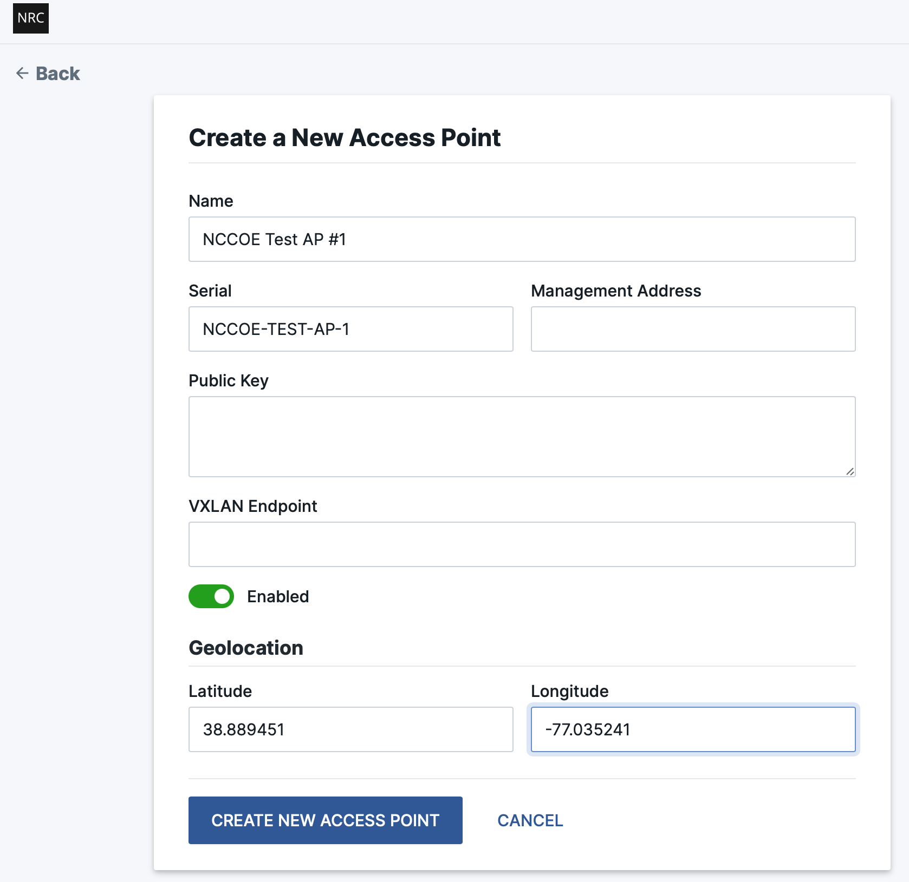

and select "CREATE NEW ACCESS POINT".

3. When an AP is created without a public key, a registration token is automatically created by the Controller.

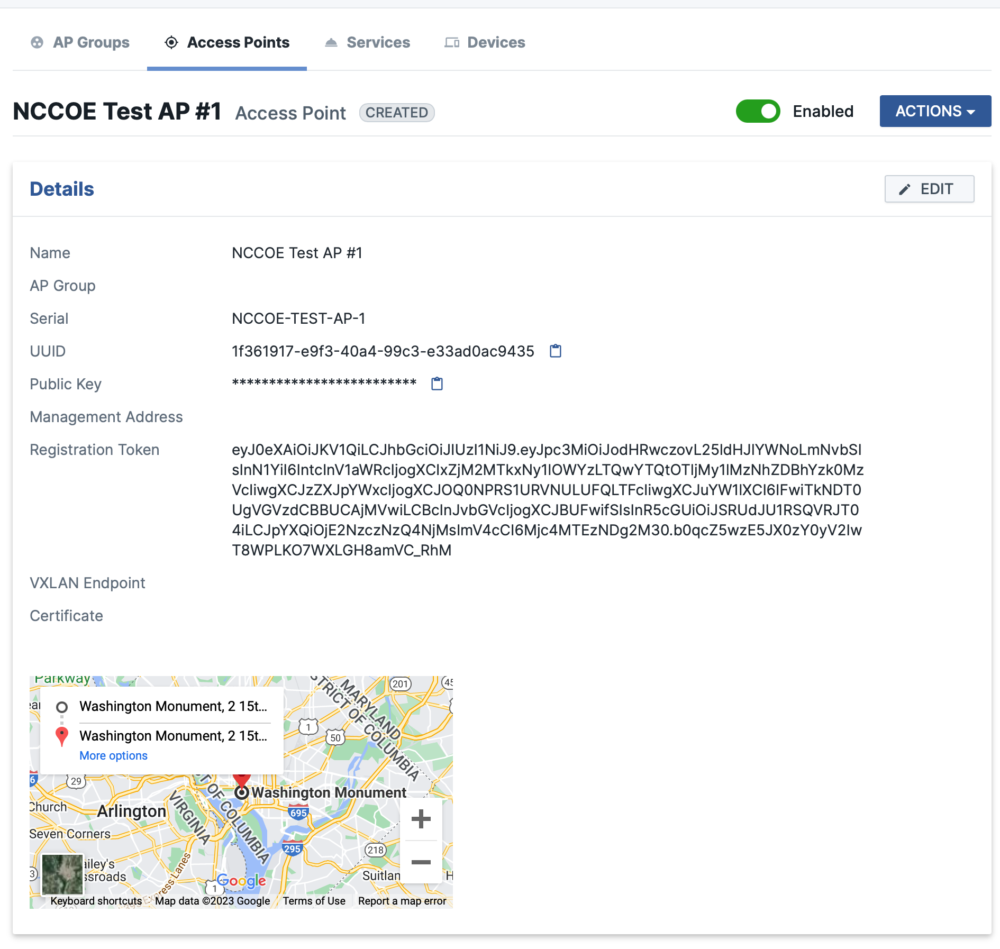

The AP setup instructions in the next section will describe how to configure the AP Agent with the registration token.

* Note: The registration token in this example isn't obfuscated since it's one-time-use.

### Creating an AP Group in the Custom Connectivity Controller

In order for an AP to be usable by customers (via the creation of Services) it has to be joined into an AP Group. 
An AP Group represents a collection of APs which cover a contiguous or non-contiguous geographical area to provide Custom Connectivity service to the devices in the area.
Each AP Group collectively provides the same SSID(s) so devices can easily roam within the area with no user intervention.

### Creating an AP Group

From the "AP Groups" tab, select "CREATE" to bring up the AP Group creation dialog.

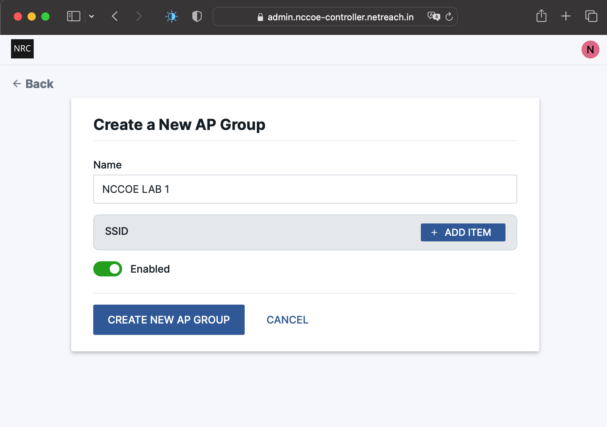

Give the AP Group a name for the region where the reference AP(s) will be located.
And select "ADD ITEM" to define an SSID for the AP Group.

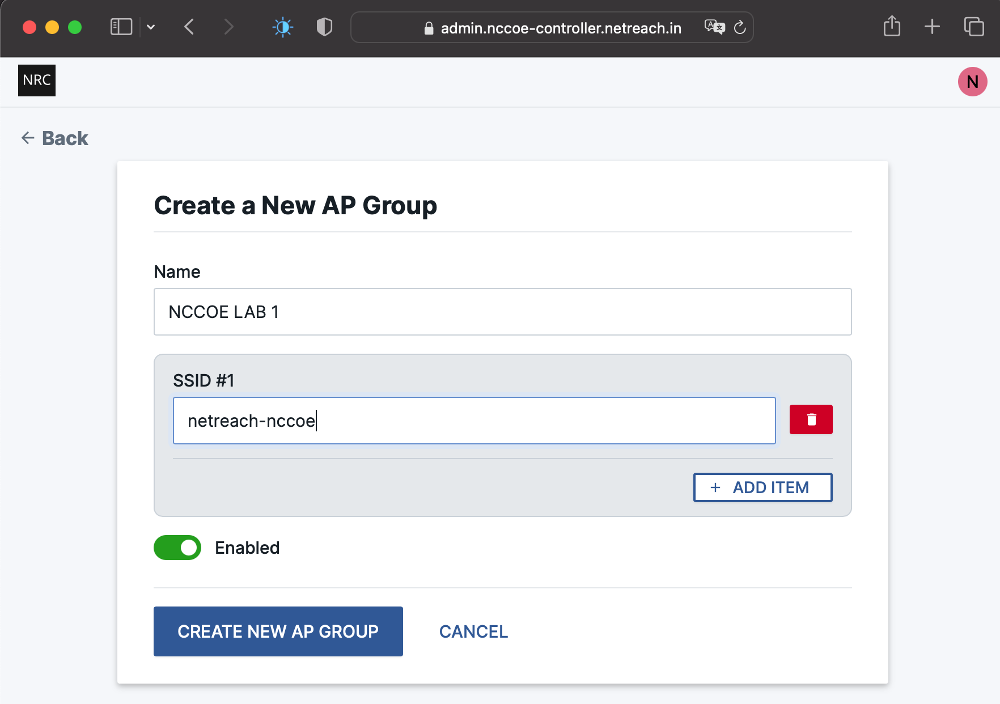

Enter an SSID for the AP Group and select "CREATE NEW AP GROUP" to complete the AP Group creation.

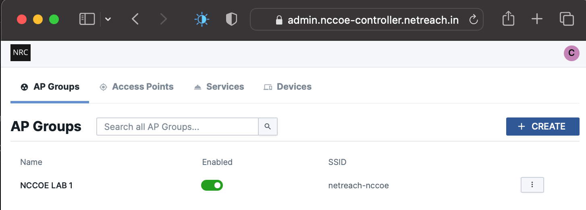

The created AP Group can have AP's added into it to provide service to customers, as described below.

### Adding the test AP(s) to the AP Group

To add the AP provisioned above into the AP Group created above, select "ASSOCIATE ANOTHER AP" from the AP Group "Details" page and select the AP provisioned above. 

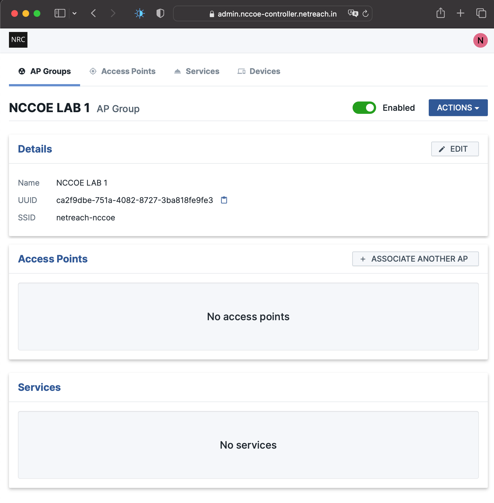

Start typing the name of the AP to find the test AP setup above.

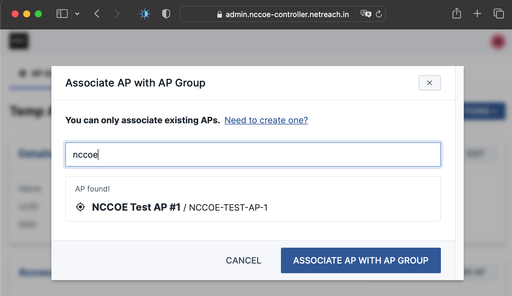

And select "ASSOCIATE AP WITH AP GROUP" to complete the association process.

### Creating a test Service(s) in the Custom Connectivity Controller

In Custom Connectivity, Services represent a collection of Devices managed, operated, and funded by a particular subscriber. 
Within a Service, devices are organized into Trust Domains. 
Devices in a Trust Domain are allowed to discover and communicate with each other with no restrictions - as if they were on the same local-area network.
(Devices may be allowed to communicate with each other across Trust Domains, but only if explicitly provisioned - which is not covered here.)

### Creating a test Service

Creation of a Service would typically be performed via a OSS/BSS "portal" - which would provide many of the values here. 
Via the Custom Connectivity admin console, Services can be created from the Services tab.
From here, select "CREATE" to bring up the Service creation dialog.

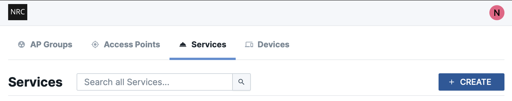

Many of these settings can be set arbitrarily - since the test Service won't be associated with an OSS/BSS.

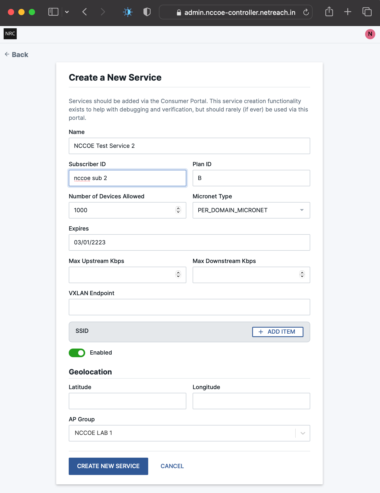

Make sure the to set the following Service fields:

 * Set the "Micronet Type" to "PER_DOMAIN_MICRONET"
 * Set the "Expires" field to a date in the far future (expiry is only enforced by a OSS/BSS Portal)
 * Make sure the Service is "Enabled"
 * The AP Group should be set to the AP Group setup above

Leave all other settings blank and select "CREATE NEW SERVICE" to create the Service.
 
Once the Service is created, you should see a Service Details page with no Trust Domains or Devices.

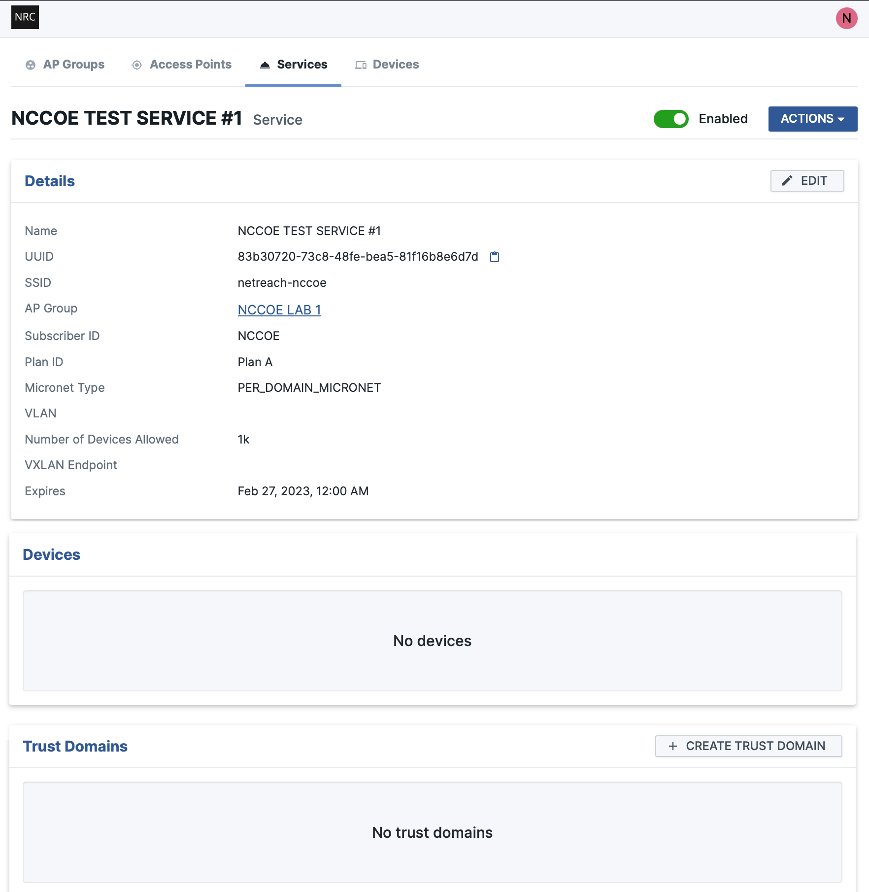

### Creating a Trust Domain

In Custom Connectivity, each Service contains one or more groupings of devices called _Trust Domains_. 
Devices in a Trust Domain share some common policy and can communicate with each other as if they were on a shared LAN. 
And typically each Trust Domain will be setup to be a separate private IP subnet. 

To create a Trust Domain, select "CREATE TRUST DOMAIN" from the Service details page (see above). This will bring up the Trust Domain creation dialog. 

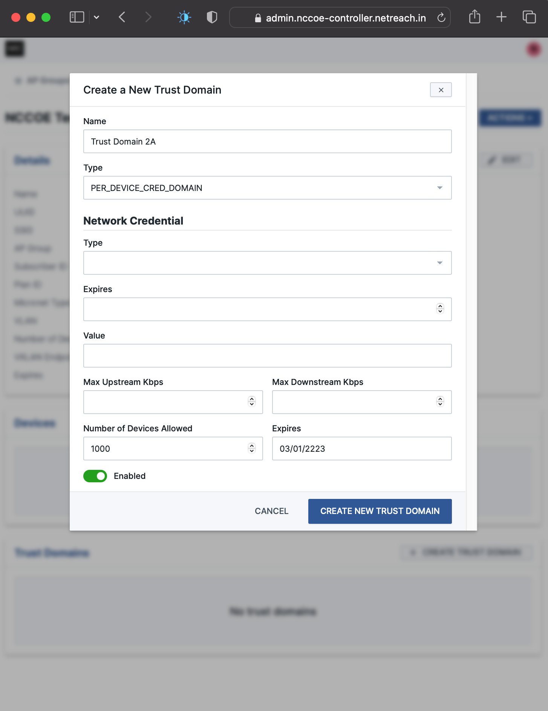

Creation of a _Trust Domain_ would typically be performed via a OSS/BSS "portal" - which would provide many of the Trust Domain values.

Make sure the to set the following Service fields:

* Set the "Type" field to "PER_DEVICE_CRED_DOMAIN"
* In a _PER_DEVICE_CRED_DOMAIN_ the Network Credential "Type", "Expires", and "Value" fields should all be blank.
* Leave the "Max Upstream/Downstream Kbps" values unset
* Set the "Number of Devices Allowed" as desired
* Set the "Expires" field to a date in the far future (expiry is only enforced by a OSS/BSS Portal)
* Make sure the Trust Domain is "Enabled"

and select "CREATE NEW TRUST DOMAIN" to complete the process. 
This process can be repeated multiple times to create multiple Trust Domains.

## Reference AP Configuration

### Configure the serial number for the Custom Connectivity Agent/AP

Create a file named `/opt/micronets-gw/lib/netreach-serialnum.txt` and enter the serial number for the AP created above. .

```
echo "NCCOE-TEST-AP-1" > /opt/micronets-gw/lib/netreach-serialnum.txt
```

### Register the AP with the Custom Connectivity Controller

In order for the Custom Connectivity Agent adapter to login to the mqtt broker as well as the Controller, the following steps are needed to register the Custom Connectivity Agent/AP with the Custom Connectivity Controller. 
These steps only need to be done once after the agent installation.

There are two ways to have the AP registered with the controller:

1. The AP is provisioned with a "registration token". 
The AP generates its own public/private keypair and uses the one-time-use registration token to register the AP with the Controller.

2. A public/private keypair is generated on (or for) the AP and the public key is registered with the controller (using user/operator credentials).

Only method (1) is described in this document.

To enable the AP to register, save the registration token created for the AP via the Custom Connectivity Controller into the file `/opt/micronets-gw/lib/netreach-reg-token.txt`.
When the reference AP agent starts up, it will generate an ECC public/private keypair and register the public key using the registration token.
Once used the `netreach-reg-token.txt` file will be deleted by the agent.

Once the AP agent's public key has been registered with the Controller, the agent will be able to authenticate and retrieve the api tokens it needs to communicate with the controller, determine which AP group it belongs to, and communicate with the mqtt broker.

## Starting the AP software components

These instructions can be used to startup the software components manually. Steps are also provided to have the components automatically start at system bootup.
Startup of these components should be run in the order listed below.

### Setup the AP software bridges and routing tables

The reference AP utilizes software bridges to perform traffic isolation, access control, and inter-AP vxlan communication. These need to be setup each time the AP boots. This can be done manually using:

```
sudo /opt/micronets-gw/bin/setup-vlan-bridges.sh
```

This script can be run at system startup by adding the path to the script to the end of the file `/etc/rc/rc.local`:

```
/opt/micronets-gw/bin/setup-vlan-bridges.sh
```

Specifically, the script performs the following:

- Creates a veth pair "haport/haport-sw". The "haport" is the means to hook up hostapd's vlan tagged traffic to the OVS switch.
- Ensures that the `vlan-tagged-interface` setting in `/opt/micronets-hostapd/lib/hostapd.conf` file has the value "haport" (this should be the default)
- Ensures that the `bridge` parameter in the `hostap.conf` file is commented out
- Ensures that you only have one IP address on your WAN port (typically eth0)

### Starting the micronets-hostapd service

The micronets-hostapd service is managed via a systemctl service (installed above) and can be started using:

```
sudo systemctl start micronets-hostapd.service
```

You can check to see if the hostap service is running with:

```
sudo systemctl status micronets-hostapd.service
```

If everything is operating as expected, you should see a status report similar to the following:

```
● micronets-hostapd.service - CableLabs Micronets hostapd service
   Loaded: loaded (/lib/systemd/system/micronets-hostapd.service; disabled; vendor preset: enabled)
   Active: active (running) since Wed 2023-03-22 00:20:11 PDT; 4s ago
 Main PID: 22641 (hostapd)
    Tasks: 1 (limit: 2062)
   CGroup: /system.slice/micronets-hostapd.service
           └─22641 /opt/micronets-hostapd/bin/hostapd /opt/micronets-hostapd/lib/hostapd.conf

systemd[1]: Started CableLabs Micronets hostapd service.
micronets-hostapd[22641]: wlan0: interface state UNINITIALIZED->COUNTRY_UPDATE
micronets-hostapd[22641]: wlan0: interface state COUNTRY_UPDATE->ENABLED
micronets-hostapd[22641]: wlan0: AP-ENABLED
```


To have the micronets-hostapd service start automatically at bootup use:

```
sudo systemctl enable micronets-hostapd.service
```

### Starting the micronets-gw service

The micronets-gw service is also managed via a systemctl service (installed above) and can be started using:

```
sudo systemctl start micronets-gw.service
```

You can check to see if the gateway service is running using:

```
sudo systemctl status micronets-gw.service
```

If everything is operating as expected, you should see a status report similar to the following:

```
● micronets-gw.service - Micronets Gateway Service
   Loaded: loaded (/lib/systemd/system/micronets-gw.service; disabled; vendor preset: enabled)
   Active: active (running) since Wed 2023-03-22 00:16:55 PDT; 9s ago
 Main PID: 22424 (python)
    Tasks: 3 (limit: 2062)
   CGroup: /system.slice/micronets-gw.service
           ├─22424 /opt/micronets-gw/virtualenv/bin/python runner.py --config config.DefaultConfig
           └─22430 /opt/micronets-hostapd/bin/hostapd_cli

systemd[1]: Started Micronets Gateway Service.
micronets-gw-service[22424]: Running with config config.DefaultConfig
micronets-gw-service[22424]: Logging to logfile /opt/micronets-gw/micronets-gw.log (level 10)
micronets-gw-service[22424]: Starting gateway service on 0.0.0.0:5000
micronets-gw-service[22424]: Running on http://0.0.0.0:5000 (CTRL + C to quit)
micronets-gw-service[22424]: ASGI Framework Lifespan error, continuing without Lifespan support
```

To have the micronets-gw service start automatically at bootup use:

```
sudo systemctl enable micronets-gw.service
```

### Starting the OCF/DPP streamlined onboarding Diplomat

The OCF DPP diplomat is managed via a systemctl service (installed above) and can be started using:

```
sudo systemctl start diplomat.service
```

You can check to see if the diplomat service is running using:

```
sudo systemctl status diplomat.service
```

If everything is operating as expected, you should see a status report similar to the following:

```
● diplomat.service - Streamlined onboarding  OCF Diplomat
   Loaded: loaded (/lib/systemd/system/diplomat.service; enabled; vendor preset: enabled)
   Active: active (running) since Wed 2023-03-22 01:30:39 MDT; 3s ago
 Main PID: 12060 (dpp_diplomat)
    Tasks: 3 (limit: 3720)
   CGroup: /system.slice/diplomat.service
           └─12060 /usr/local/bin/dpp_diplomat

dpp_diplomat[12060]: DEBUG: ../../security/oc_acl.c <oc_sec_ace_get_res:693>: Adding ACE for subject bcc8c7df-8c99-4d25-621b-9a3001ac94c9
dpp_diplomat[12060]: DEBUG: ../../security/oc_acl.c <oc_sec_ace_get_res:741>: Adding resource /diplomat with permission 31
dpp_diplomat[12060]: DEBUG: ../../api/oc_main.c <oc_main_init:258>: oc_main_init(): loading sp
dpp_diplomat[12060]: DEBUG: ../../api/oc_main.c <oc_main_init:260>: oc_main_init(): loading ael
dpp_diplomat[12060]: DEBUG: ../../api/oc_main.c <oc_main_init:263>: oc_main_init(): loading ECDSA keypair
dpp_diplomat[12060]: DEBUG: ../../security/oc_store.c <oc_sec_load_ecdsa_keypair:241>: successfully read ECDSA keypair for device 0
dpp_diplomat[12060]: DEBUG: ../../api/oc_main.c <oc_main_init:266>: oc_main_init(): loading sdi
dpp_diplomat[12060]: DEBUG: ../../security/oc_pstat.c <dump_pstat_dos:98>: oc_pstat: dos is RFNOP
dpp_diplomat[12060]: DEBUG: ../../api/oc_main.c <oc_main_init:283>: oc_main: stack initialized
dpp_diplomat[12060]: WARNING: ../../apps/streamlined_onboarding/ocf_dpp.c <dpp_so_named_pipe_init:115>: Failed to create named pipe; already ex
```


To have the diplomat service start automatically at bootup use:

```
sudo systemctl enable diplomat.service
```


